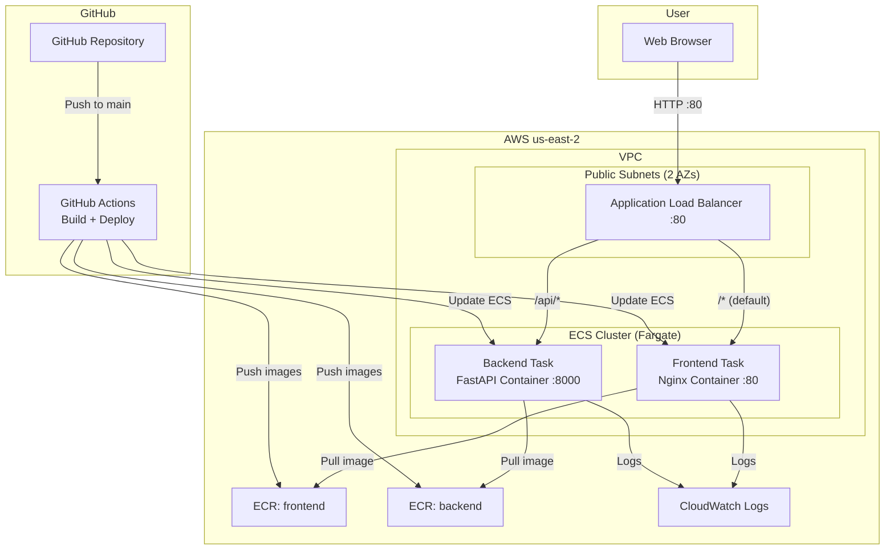
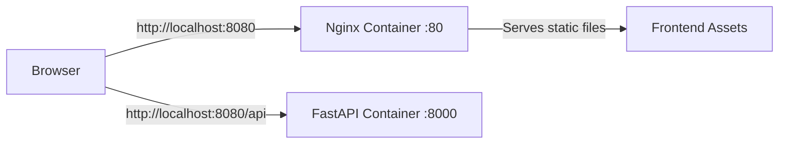
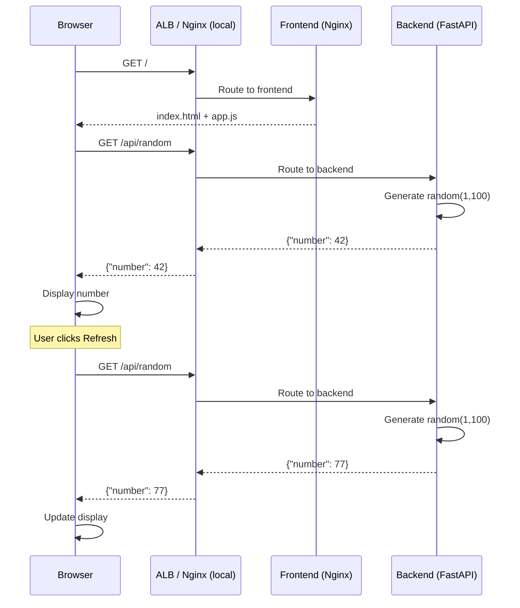
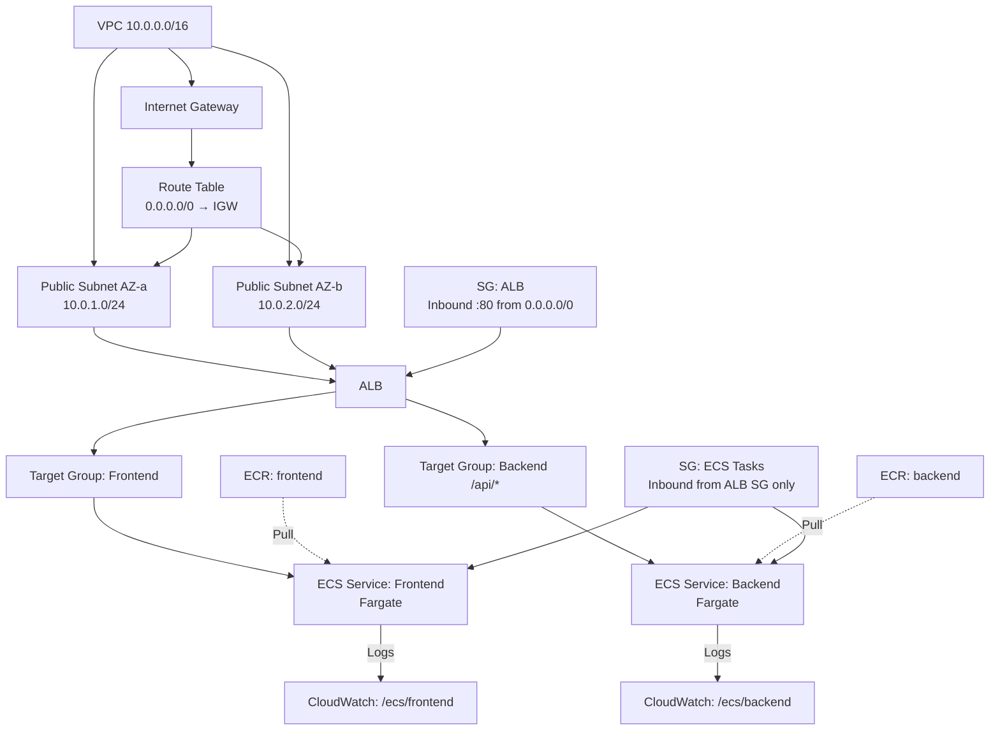
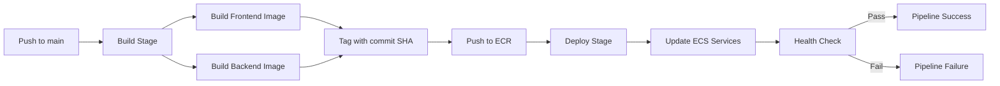

# Design Document: Random Number Service

## Overview

This design describes a two-tier web application consisting of a FastAPI backend that generates random numbers and a Bootstrap-based static frontend served via Nginx. The system is developed locally using Docker Compose and deployed to AWS ECS Fargate in us-east-2 with full infrastructure-as-code via Terraform. An Application Load Balancer provides path-based routing: `/api/*` routes to the backend, all other paths route to the frontend. Container images are stored in ECR, CI/CD is handled by GitHub Actions, and logs are centralized in CloudWatch.

## Architecture

### High-Level Architecture Diagram



### Local Development Architecture



In local development, Docker Compose runs both containers. The frontend Nginx container proxies `/api` requests to the backend container, mirroring the ALB path-based routing in production.

### Design Decisions

1. **Fargate over EC2**: No server management overhead. Suitable for a lightweight service with predictable resource needs.
2. **ALB path-based routing**: Single entry point for both frontend and backend. The frontend uses relative `/api` paths, so no hardcoded URLs are needed.
3. **Nginx for frontend**: Efficient static file serving with minimal resource usage. Also handles `/api` proxy in local dev.
4. **Local Terraform state**: Simplicity for a single-developer project. No remote state backend needed.
5. **ECR in same region**: Minimizes image pull latency and avoids cross-region data transfer costs.
6. **CloudWatch awslogs driver**: Native ECS integration, no sidecar containers needed.


## Components and Interfaces

### 1. Backend: Random Number Service (FastAPI)

**Location**: `backend/`

**Responsibilities**:
- Expose a `GET /api/random` endpoint returning a random integer 1–100
- Return JSON responses with appropriate HTTP status codes
- Include CORS headers for cross-origin frontend requests
- Return HTTP 500 with JSON error body on internal failures

**Interface**:

```
GET /api/random
Response 200:
  Content-Type: application/json
  Body: { "number": <int 1-100> }

Response 500:
  Content-Type: application/json
  Body: { "error": "<message>" }

OPTIONS /api/random
Response 200:
  Access-Control-Allow-Origin: *
  Access-Control-Allow-Methods: GET, OPTIONS
  Access-Control-Allow-Headers: Content-Type
```

**Key files**:
- `backend/main.py` — FastAPI app with `/api/random` route and CORS middleware
- `backend/Dockerfile` — Python-based image running uvicorn

### 2. Frontend: Static Bootstrap Site

**Location**: `frontend/`

**Responsibilities**:
- Display a random number fetched from `/api/random`
- Provide a refresh button to request a new number
- Show loading state while waiting for API response
- Show error messages when the backend is unreachable or returns errors
- Use relative `/api` path for all backend requests

**Key files**:
- `frontend/index.html` — Bootstrap-styled page with number display, refresh button, loading indicator, and error display
- `frontend/app.js` — Fetch logic, UI state management
- `frontend/nginx.conf` — Nginx config serving static files; in local dev, proxies `/api` to backend
- `frontend/Dockerfile` — Nginx-based image copying static assets and config

### 3. Infrastructure (Terraform)

**Location**: `infra/`

**Responsibilities**:
- Provision a self-contained VPC with public subnets across 2 AZs
- Create Internet Gateway, route tables, and security groups
- Create ECS Cluster (Fargate) with task definitions for frontend and backend
- Create ALB with path-based routing rules
- Create ECR repositories for both container images
- Create CloudWatch log groups for ECS tasks
- Manage all resources with local Terraform state

**Key files**:
- `infra/main.tf` — Provider config, VPC, subnets, IGW, route tables
- `infra/ecs.tf` — ECS cluster, task definitions, services
- `infra/alb.tf` — ALB, target groups, listener rules
- `infra/ecr.tf` — ECR repositories
- `infra/logs.tf` — CloudWatch log groups
- `infra/security.tf` — Security groups
- `infra/variables.tf` — Input variables
- `infra/outputs.tf` — ALB DNS name, ECR URIs

### 4. CI/CD (GitHub Actions)

**Location**: `.github/workflows/`

**Responsibilities**:
- Build Docker images for frontend and backend on push to main
- Tag images with Git commit SHA
- Push images to ECR
- Deploy updated images to ECS tasks
- Run post-deployment health checks with configurable timeout
- Fail pipeline if any ECS task doesn't stabilize

**Key files**:
- `.github/workflows/deploy.yml` — Build, push, deploy, and health check workflow

### 5. Docker Compose (Local Dev)

**Location**: project root

**Responsibilities**:
- Define frontend and backend services
- Wire up networking so frontend can proxy to backend
- Load environment variables from `.env`

**Key files**:
- `docker-compose.yml` — Service definitions, port mappings, env file reference

### Component Interaction Diagram




## Data Models

### API Response: Success

```json
{
  "number": 42
}
```

| Field    | Type | Constraints       | Description                    |
|----------|------|-------------------|--------------------------------|
| `number` | int  | 1 ≤ value ≤ 100   | Randomly generated integer     |

### API Response: Error

```json
{
  "error": "Internal server error during number generation"
}
```

| Field   | Type   | Description                |
|---------|--------|----------------------------|
| `error` | string | Human-readable error message |

### Environment Variables (.env)

| Variable              | Required | Description                              |
|-----------------------|----------|------------------------------------------|
| `GITHUB_TOKEN`        | Yes      | GitHub PAT for repo creation and Actions  |
| `AWS_ACCESS_KEY_ID`   | Yes      | AWS access key for ECR/ECS operations     |
| `AWS_SECRET_ACCESS_KEY`| Yes     | AWS secret key for ECR/ECS operations     |

### Terraform Variables

| Variable        | Default          | Description                          |
|-----------------|------------------|--------------------------------------|
| `aws_region`    | `us-east-2`      | AWS region for all resources         |
| `project_name`  | `random-number-service` | Prefix for resource naming    |
| `vpc_cidr`      | `10.0.0.0/16`    | CIDR block for the VPC               |
| `frontend_port` | `80`             | Port exposed by Nginx container      |
| `backend_port`  | `8000`           | Port exposed by FastAPI container    |
| `cpu`           | `256`            | Fargate task CPU units               |
| `memory`        | `512`            | Fargate task memory (MiB)            |

### ECS Task Definition Structure

```json
{
  "family": "random-number-service-backend",
  "networkMode": "awsvpc",
  "requiresCompatibilities": ["FARGATE"],
  "cpu": "256",
  "memory": "512",
  "containerDefinitions": [
    {
      "name": "backend",
      "image": "<ecr_uri>:latest",
      "portMappings": [{ "containerPort": 8000 }],
      "logConfiguration": {
        "logDriver": "awslogs",
        "options": {
          "awslogs-group": "/ecs/random-number-service-backend",
          "awslogs-region": "us-east-2",
          "awslogs-stream-prefix": "ecs"
        }
      }
    }
  ]
}
```

### Infrastructure Resource Map



### CI/CD Pipeline Flow




## Correctness Properties

*A property is a characteristic or behavior that should hold true across all valid executions of a system — essentially, a formal statement about what the system should do. Properties serve as the bridge between human-readable specifications and machine-verifiable correctness guarantees.*

### Property 1: API response returns valid random number

*For any* GET request to the `/api/random` endpoint, the response SHALL have HTTP status 200, content type `application/json`, and contain a JSON body with a `number` field whose value is an integer between 1 and 100 inclusive.

**Validates: Requirements 1.1, 1.2, 1.3**

### Property 2: CORS headers present on all responses

*For any* response from the Random_Number_Service (including both GET and OPTIONS requests), the response SHALL include `Access-Control-Allow-Origin` headers permitting cross-origin requests.

**Validates: Requirements 5.1**

### Property 3: Frontend displays error with status code for non-200 responses

*For any* non-200 HTTP status code returned by the Random_Number_Service, the Frontend SHALL display an error message that contains the numeric status code.

**Validates: Requirements 4.2**

### Property 4: Startup rejects missing required tokens

*For any* subset of required environment variables (`GITHUB_TOKEN`, `AWS_ACCESS_KEY_ID`, `AWS_SECRET_ACCESS_KEY`) where at least one is missing, the application SHALL fail validation at startup and not accept requests.

**Validates: Requirements 9.4**

### Property 5: All dependencies have pinned versions

*For any* line in `requirements.txt` that specifies a package dependency, the line SHALL contain a pinned version using the `==` operator.

**Validates: Requirements 10.2**

### Property 6: Infrastructure directory contains no application code

*For any* file in the `infra/` directory, the file extension SHALL NOT be `.py`, `.js`, `.html`, `.css`, or any other application source code extension — only `.tf`, `.tfvars`, `.hcl`, and related Terraform files.

**Validates: Requirements 11.3**

### Property 7: CI/CD workflows contain no hardcoded secrets

*For any* file in `.github/workflows/`, the file content SHALL NOT contain hardcoded AWS access keys, secret keys, or tokens. All sensitive values SHALL be referenced via `${{ secrets.* }}` or environment variable syntax.

**Validates: Requirements 16.7**

### Property 8: Frontend uses only relative paths for API requests

*For any* API request URL in the frontend source code, the URL SHALL be a relative path (starting with `/`) and SHALL NOT contain absolute URLs (no `http://` or `https://` prefixes pointing to backend services).

**Validates: Requirements 22.1, 22.2**


## Error Handling

### Backend (FastAPI)

| Scenario                        | HTTP Status | Response Body                          | Action                              |
|---------------------------------|-------------|----------------------------------------|-------------------------------------|
| Successful random number gen    | 200         | `{"number": <int>}`                    | Return number                       |
| Internal error during generation| 500         | `{"error": "<message>"}`               | Log error, return JSON error body   |
| Invalid HTTP method             | 405         | Method Not Allowed (FastAPI default)   | FastAPI handles automatically       |
| Unknown route                   | 404         | Not Found (FastAPI default)            | FastAPI handles automatically       |

### Frontend

| Scenario                          | User-Facing Behavior                                    |
|-----------------------------------|---------------------------------------------------------|
| Backend unreachable (network err) | Display "Service unavailable" error message             |
| Backend returns non-200           | Display error message including the HTTP status code    |
| Request in flight                 | Show loading indicator, disable refresh button          |
| Successful response               | Display number, hide loading indicator, enable button   |

### Infrastructure / Deployment

| Scenario                              | Behavior                                                  |
|---------------------------------------|-----------------------------------------------------------|
| `.env` file missing                   | Application fails to start with descriptive error log     |
| Required env var missing              | Startup validation fails, app does not accept requests    |
| ECS task fails health check           | Deploy pipeline fails, reports which task didn't stabilize|
| ECS task crashes after start          | Deploy pipeline detects and reports failure                |
| Docker build fails in CI              | Deploy stage is skipped, pipeline reports build failure    |

## Testing Strategy

### Dual Testing Approach

This project uses both unit tests and property-based tests for comprehensive coverage:

- **Unit tests**: Verify specific examples, edge cases, integration points, and error conditions
- **Property-based tests**: Verify universal properties that must hold across all valid inputs

### Property-Based Testing

**Library**: [Hypothesis](https://hypothesis.readthedocs.io/) for Python (backend tests)

**Configuration**:
- Minimum 100 iterations per property test (`@settings(max_examples=100)`)
- Each property test must reference its design document property via a comment tag
- Tag format: `# Feature: random-number-service, Property {number}: {property_text}`

**Properties to implement**:

| Property | Description | Test Approach |
|----------|-------------|---------------|
| P1 | API response returns valid random number | Use Hypothesis to generate many requests, verify response structure and range |
| P2 | CORS headers present on all responses | Use Hypothesis with `st.sampled_from(["GET", "OPTIONS"])` to test both methods |
| P3 | Frontend error display for non-200 codes | Use fast-check (JS) to generate random non-200 status codes, verify error display |
| P4 | Startup rejects missing required tokens | Use Hypothesis to generate subsets of env vars with at least one missing |
| P5 | All dependencies have pinned versions | Use Hypothesis to generate requirements.txt content, verify pinned format |
| P6 | Infra dir has no app code | Scan files in infra/ directory, verify extensions |
| P7 | No hardcoded secrets in workflows | Scan workflow files for credential patterns |
| P8 | Frontend uses only relative paths | Scan frontend source for URL patterns |

Each correctness property MUST be implemented by a SINGLE property-based test.

### Unit Testing

**Backend** (pytest):
- `GET /api/random` returns 200 with valid JSON (example test)
- `OPTIONS /api/random` returns CORS headers (example test)
- Error scenario returns 500 with JSON error body (example test)
- Endpoint is mounted under `/api` prefix (example test)

**Frontend** (manual or browser-based):
- Page loads and displays a number (example test)
- Refresh button triggers new API call (example test)
- Loading indicator appears during request (example test)
- Refresh button is disabled during request (example test)
- Error message shown when backend unreachable (example test)
- Error message includes status code for non-200 (example test)

**Infrastructure** (validation):
- `docker-compose.yml` defines both services (example test)
- `docker-compose.yml` references `.env` file (example test)
- `infra/` contains `.tf` files (example test)
- Terraform uses local state (no remote backend config) (example test)
- Frontend Dockerfile uses Nginx base image (example test)
- Workflow files exist in `.github/workflows/` (example test)
- ALB routing rules defined in Terraform (example test)
- ECS tasks configured with Fargate launch type (example test)
- CloudWatch log groups configured in Terraform (example test)

### Test File Organization

```
backend/
  tests/
    test_api.py              # Unit tests for API endpoints
    test_api_properties.py   # Property-based tests (P1, P2, P4)
frontend/
  tests/
    test_frontend.js         # Frontend unit/integration tests (P3)
tests/
  test_project_structure.py  # Static analysis tests (P5, P6, P7, P8)
```
